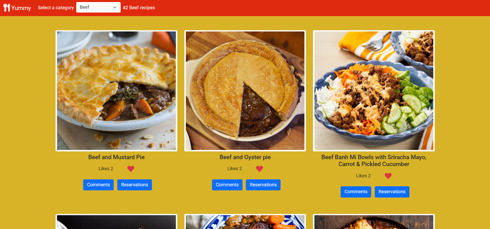
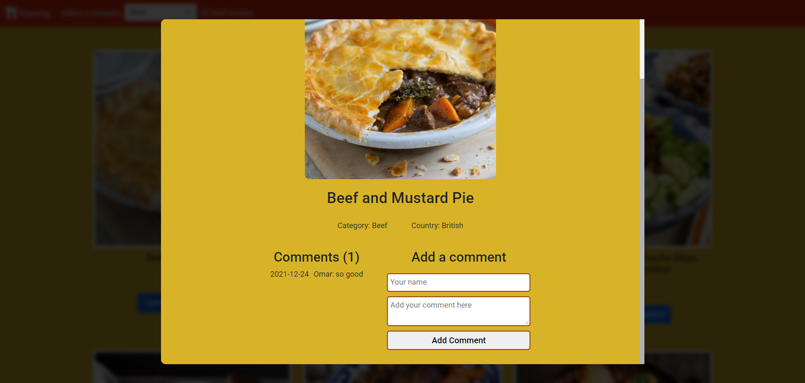

# JavaScript Capstone Project
## Description
This is the JavaScript capstone project.
We build Meal recipes website based on an external API.
## Live Demo Link
[Website live server](https://omar-muhamad.github.io/JavaScript-Capston-Project/)

## Video Demo
[Video Demo Link](https://drive.google.com/file/d/1IjgiWaM0W9-w2ZkGlV94dh3Td6D9Qcmk/view)
## Site Screenshots

## Built With

- JavaScript.
- HTML.
- CSS.
- Webpack.
- JavaScript.
- Linters.

## Install

- Install node.js from [HERE](https://nodejs.org/en/).
  
## Deployment

1. Clone the project using git-bash or Githup Desktop.
2. Open the project folder with VSCode or any Editor.
3. Open terminal and navigate to the project folder.
4. Type npm install.
5. Type npm start.

## Authors

👨‍💻 **Omar Muhammad**

- GitHub: [@Omar-Muhamad](https://github.com/Omar-Muhamad)
- Twitter: [@Eng_OmarMuhamad](https://twitter.com/Eng_OmarMuhamad)
- LinkedIn: [@eng-omarmuhammad](https://www.linkedin.com/in/eng-omarmuhammad/)

👨‍💻 **Kerolous Samy**

- GitHub: [@keroloussamy](https://github.com/keroloussamy)
- Twitter: [@kerolous_samy](https://twitter.com/kerolous_samy)
- LinkedIn: [@keroloussamy](https://www.linkedin.com/in/keroloussamy/)

## Show your support

Give a ⭐️ if you like this project!